# 3D models to real life figures

Today I want to share the process behind my latest DIY project: a cardboard tiger figure.

Full code, blender file and usage instructions are available on [Github](https://github.com/AnanasikDev/3D-Model-disk-slicer).

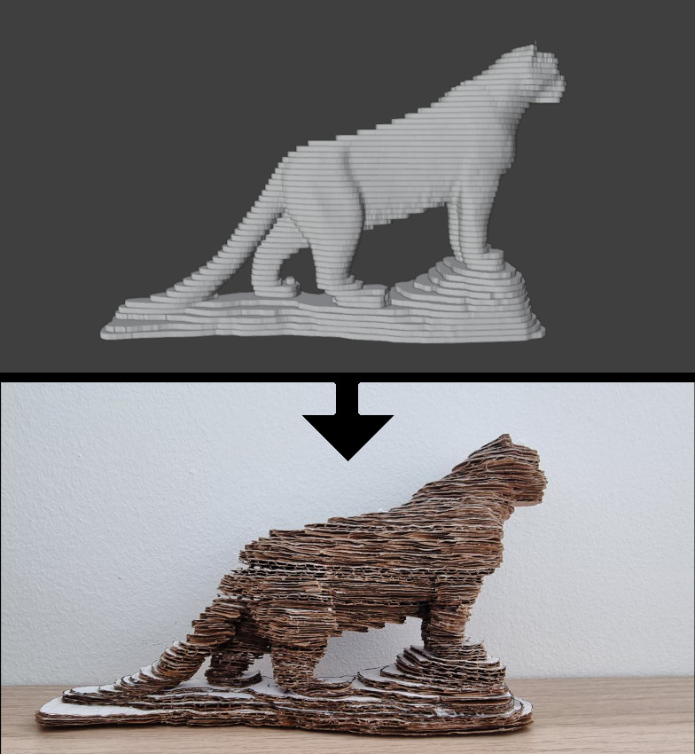

## Motivation

I have become a huge fan of large felines. As my obsession grows, I am searching for new ways to connect with their spirits. One such way is this 3D model, which now sits on my desktop.

The tiger is my favourite animal, slightly ahead of the cheetah and the leopard. Hopefully, I will be able to create models of them all, although the technology I am about to showcase in this article is rather tedious.

## Plan

My plan was rendered as following:

1. Get a 3D model to recreate
2. Find a way to convert the model into an atlas
3. Trace and cut out the pieces
4. Glue all the pieces together

Sounds like not much.

## Step #1: 3D model

Even though I had experience in 3D sculpting in Blender (see [Artstation](https://www.artstation.com/ananasikfurry)), I wanted to focus more on bringing it to life, rather than making another virtual sculpt. So I found one online on [blenderkit](https://www.blenderkit.com/asset-gallery-detail/f4c14f74-7f7b-4962-825f-b8283daa2c57/).

## Step #2: Atlas

Having found a suitable model, I was then standing upon a real challenge: I had to find a way to convert it into slices of specific thickness so that I could trace individual pieces and then glue them together.

I already had experience working with `Blender` and I didn't mind getting more, so it was out of question what software to use. However, out of the box `Blender` doesn't provide the functionality that I needed (obviously) so I had to come up with my own solution.

For that I wrote a [python script](https://github.com/AnanasikDev/3D-Model-disk-slicer/blob/main/tiger_slicer.py) to slice my model into pieces of specific thickness, essentially like [MRT](https://en.wikipedia.org/wiki/Magnetic_resonance_imaging).

---

First, the script calculates the positions and normals of all the planes that will be used to cut the model. The aim when cutting is to obtain a slice of geometry that corresponds to the intersection of the model and the cutting plane. This intersection, which is an edge loop, is then extruded and capped at both ends to create a single slice.

Note that a single slice may consist of multiple physically unrelated pieces. In this case the script fills them independently as desired. This was necessary in my case because the middle layers contained several paws, and all the pieces had to be formed correctly.

This process it is then repeated as many times as needed to cover the entire model.

---

In `Blender` it looks like this:

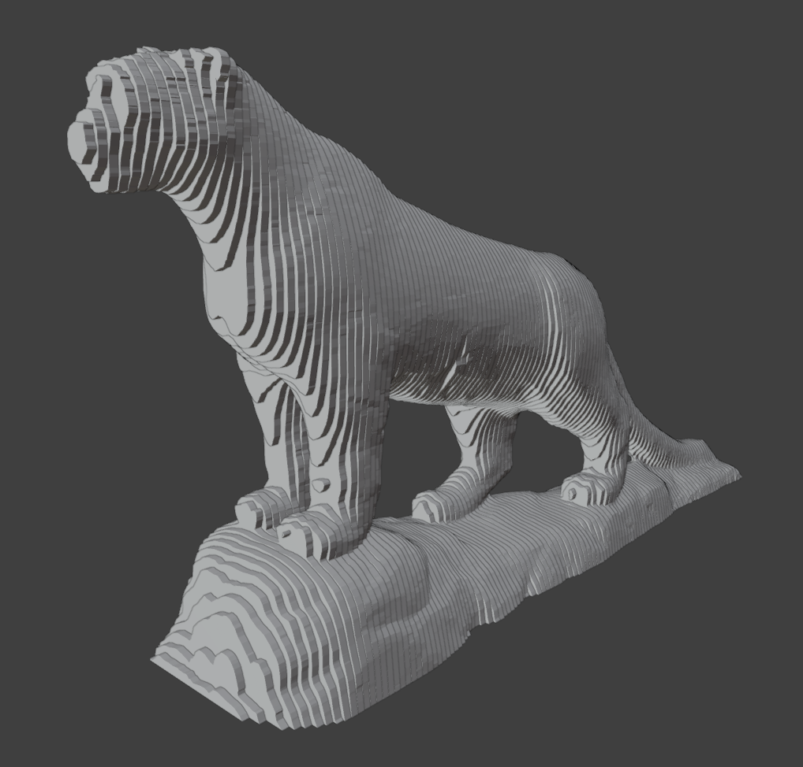
*Model sliced in the Y axis*

---

*Model sliced in the Z axis*

---

Moreover, since my plan was to trace all the pieces by hand (by placing a sheet of paper on a tablet) I added a mode to my script to automatically scatter all the pieces on a flat plane like so:

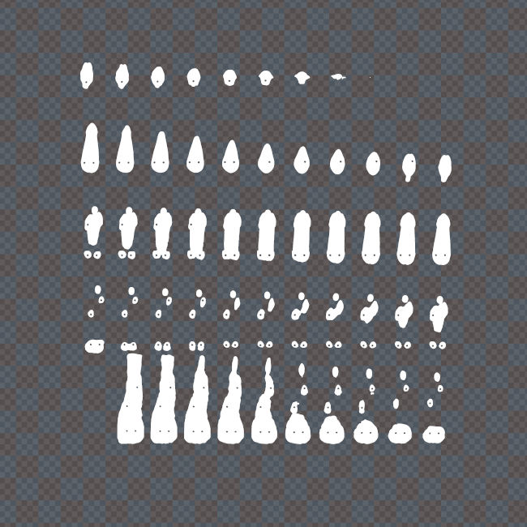

The checker pattern you see here is a special material I made that simulates correct physical size, using the scale value from the script that you initially set. One square represents exactly one centimeter.

At this point I had everything I needed to start the tedious manual work.

## Step #3: Trace and prepare

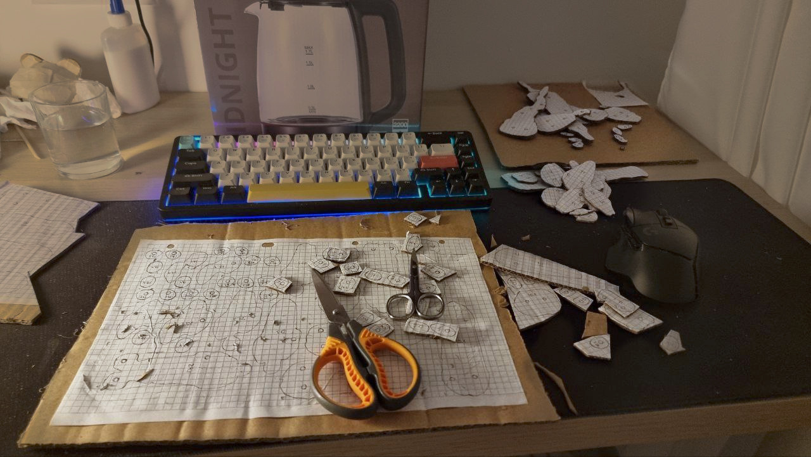

Evenings got filled with tracing shapes over and over, then glueing paper and cardboard sheets, then cutting all pieces out.

## Step #4: Assembling

Lastly, I had to glue all the pieces together. At this stage I realized that I miscalculated the thickness of my cardboard which appeared to be 1.5mm instead of 1mm thick. I compressed many of those pieces using anything heavy I had at home, and it helped. However I was inconsistent about which pieces I compress and which I do not, which resulted in a tilted model and nuances throughout the model.

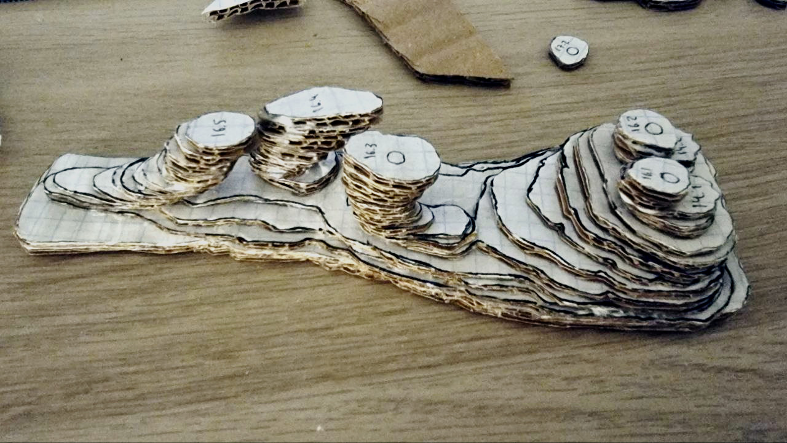

I had more than a hundred pieces so to simplify the process I made an indexation system: first number is the layer index (1-51) and second number is the piece index within its layer (none or 2-5).

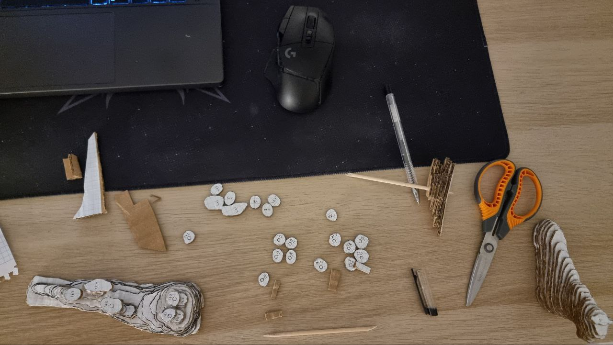

---

Originally I wanted to strenthen the model with wooden sticks which would have become its framework. I cut out exact holes in the 3D model in `Blender` and transferred them into the final pieces. It looked promising, but in the end, I hesitated and decided not to use them though. This is one of the main mistakes, because the final figure appeared to be quite wobbly and weak.

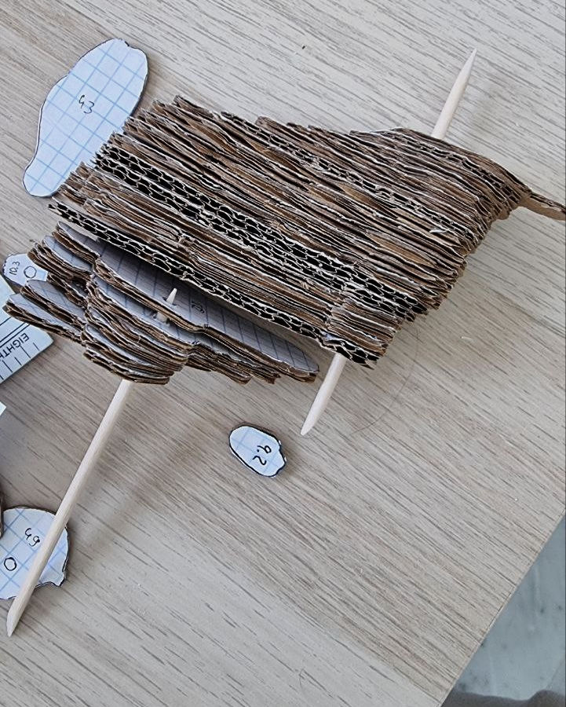

## Result

As a result, I now have this lovely physical model of my beloved tiger. Its dimensions are 170 x 104 x 46 mm.

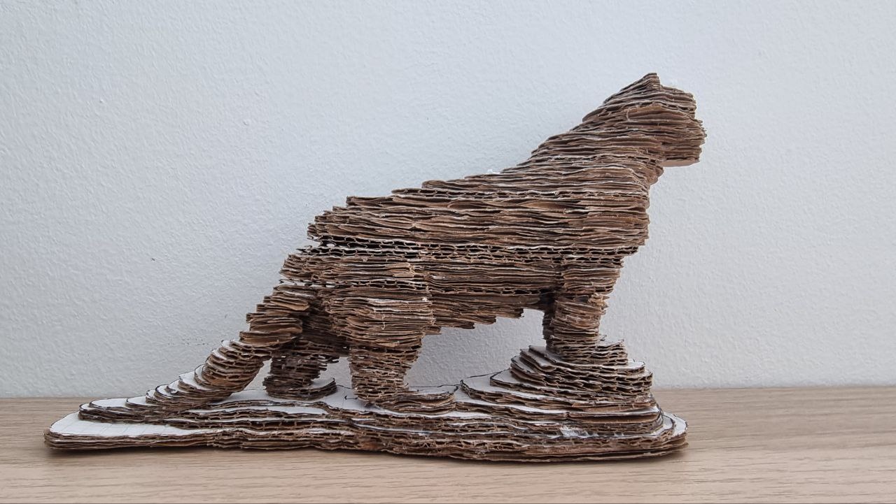
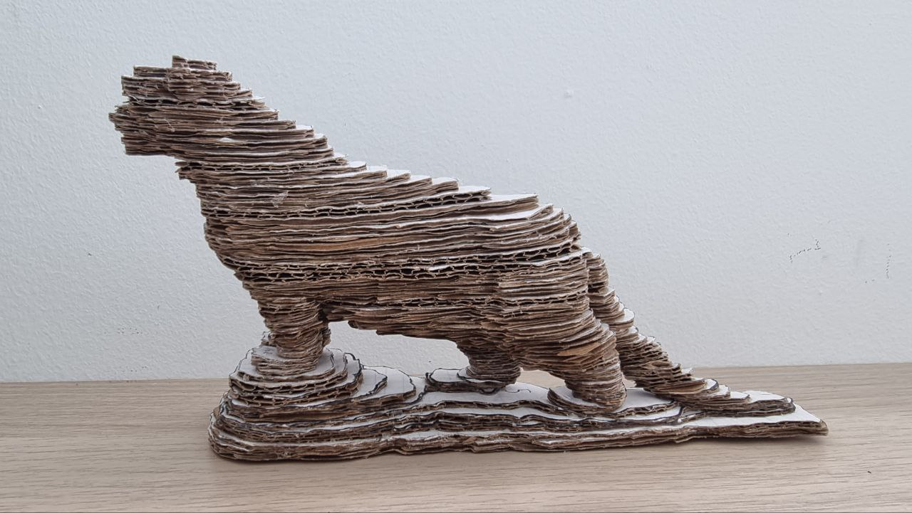
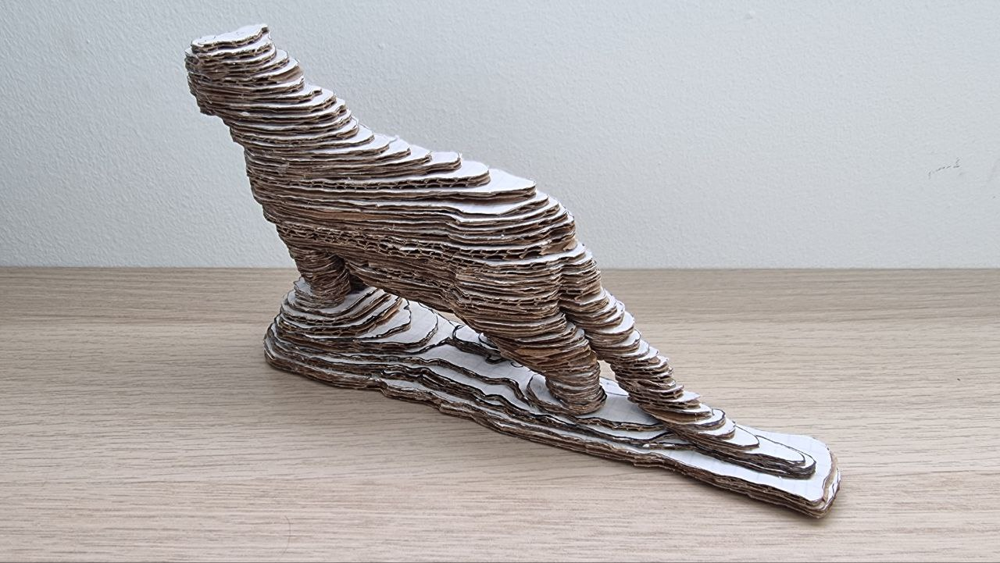
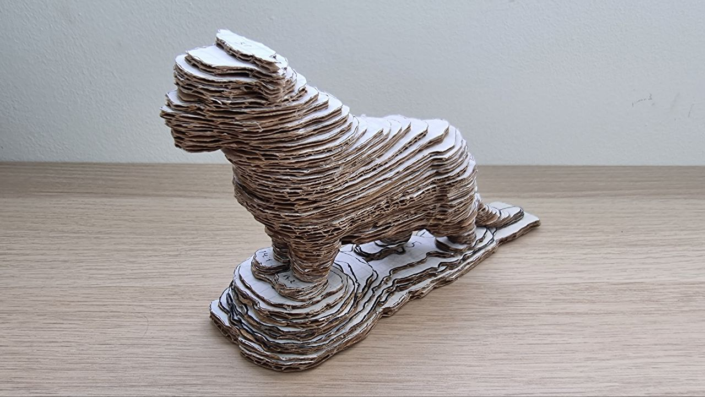
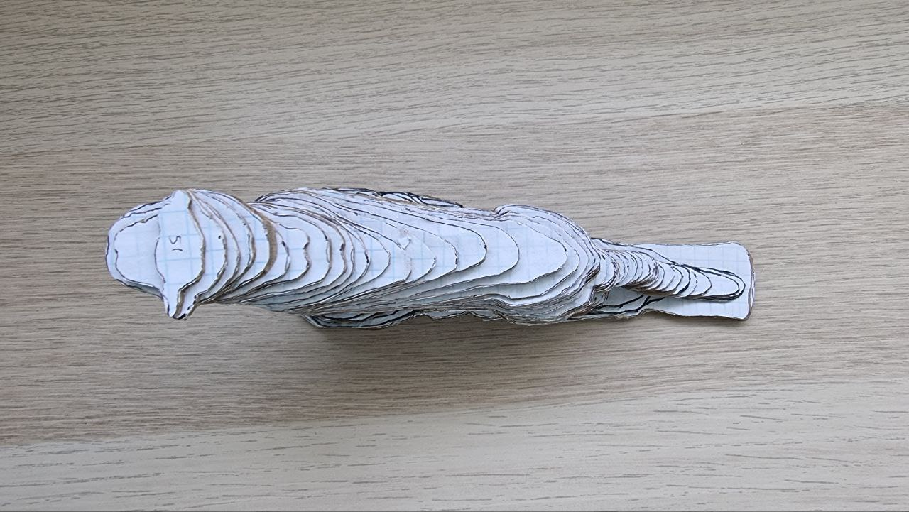

## Thanks for reading!