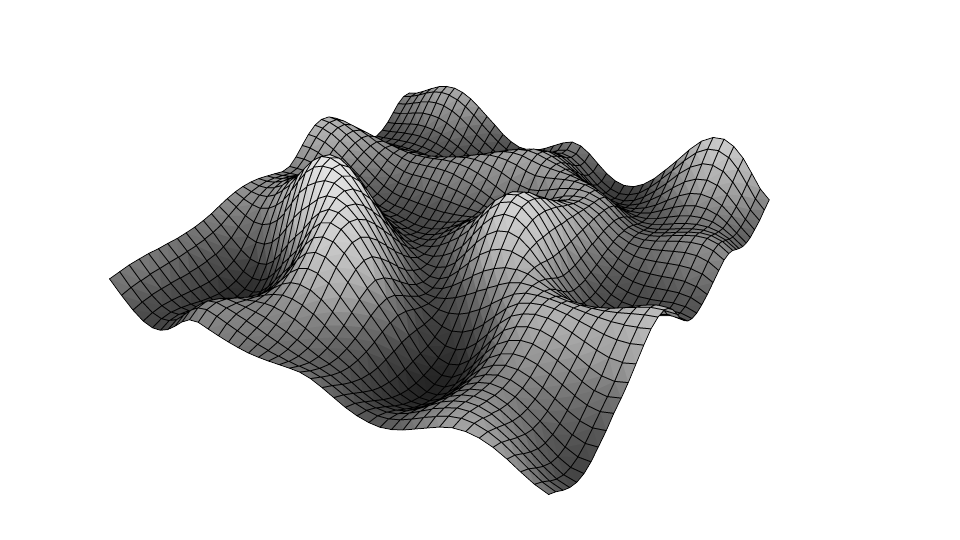
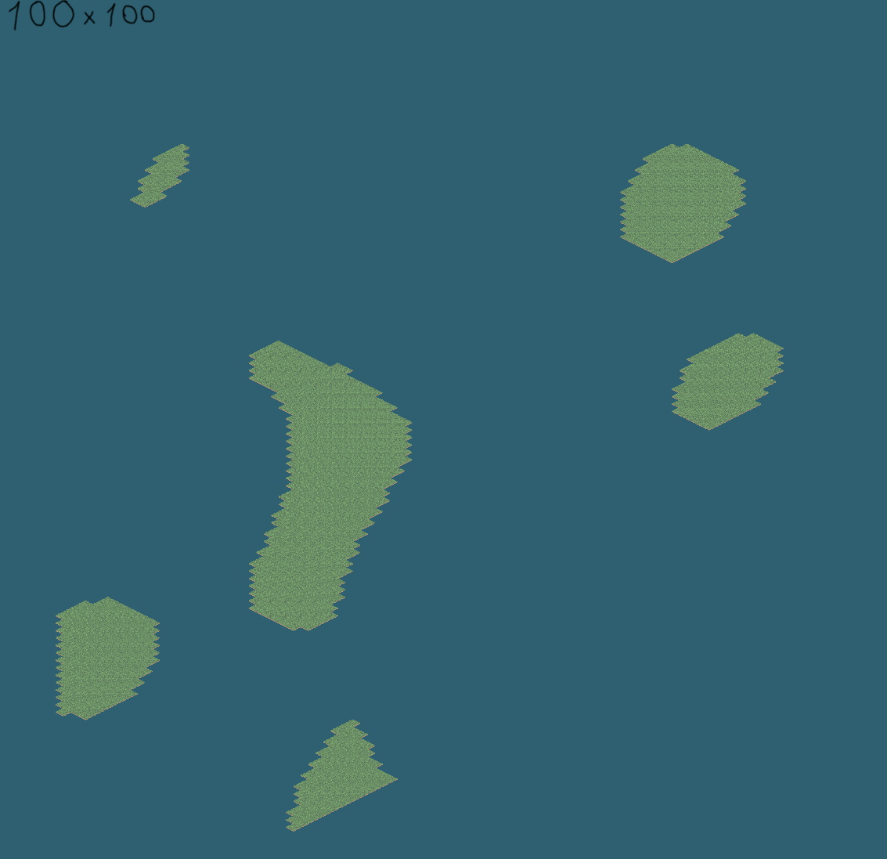
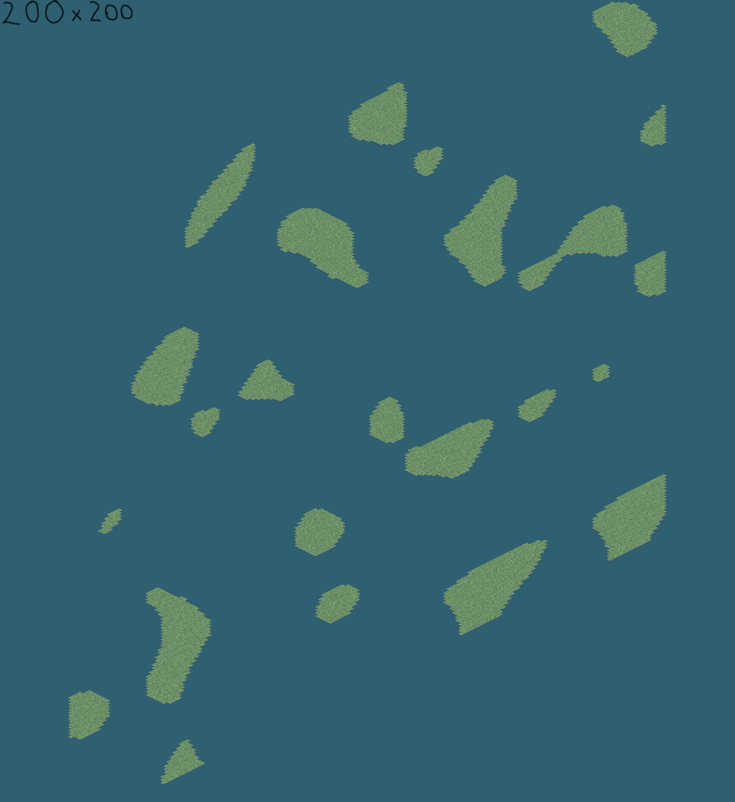
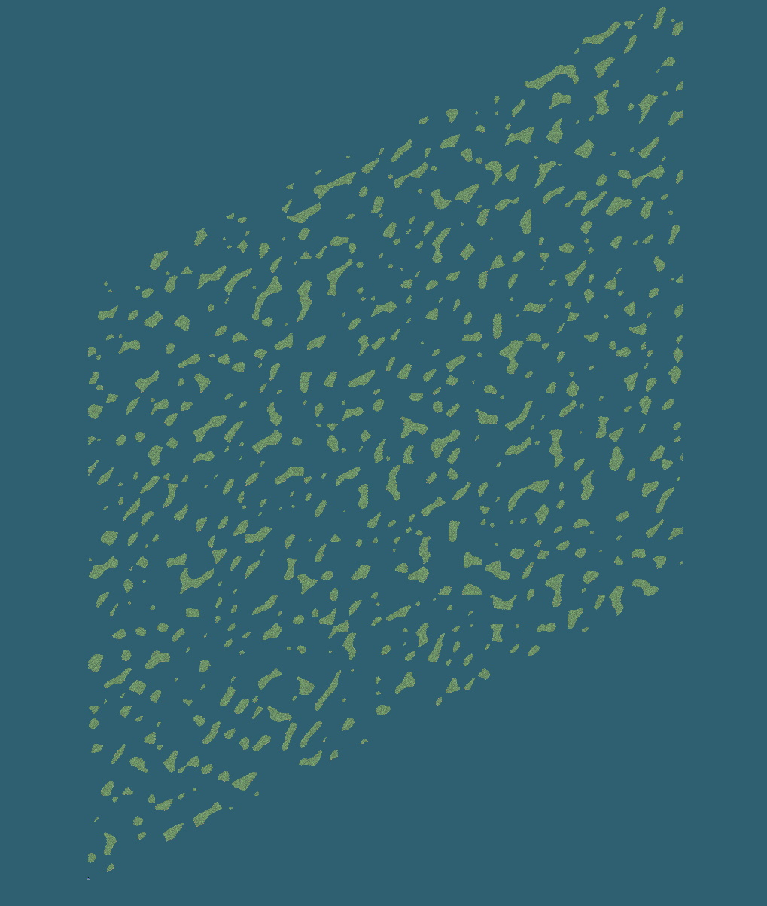

Recently I created a versatile system to generate islands in Unity and want to share my experience. There were technical issues, that are not so easy to solve, so I decided to describe the algorithm. There is no main code provided, because I just want to explain ways to fix some common problems, that may occur in many other projects, plus my code is not perfect for sure.

## Implementation

<br>

### **Stage 1 : Perlin noise as a base**

I used usual Perlin Noise algorithm, conviently implemented in Unity in ```Mathf.PerlinNoise()``` function. Basically, you use it with 2 parameters: x and y, and it returns value in this position. To have a randomly generated map each time you should shift your coordinates randomly. 

```csharp
Mathf.PerlinNoise(x * noise.scale + noise.xOffset, y * noise.scale + noise.yOffset)
```

When the value in the specific point is greater than threshold, then it is ground, otherwise it's water. The visualization describes this perfectly: peaks are islands, troughs are water.


*picture credit: [scratchapixel.com](https://www.scratchapixel.com/lessons/procedural-generation-virtual-worlds/perlin-noise-part-2/perlin-noise-terrain-mesh "https://www.scratchapixel.com/lessons/procedural-generation-virtual-worlds/perlin-noise-part-2/perlin-noise-terrain-mesh")*

Let's call this function ```IsGround(x, y) => bool``` for later.

<br>

### **Stage 2 : Islands detection**

Initially I should mention, that we have a main loop function, that passes through the whole map and tries to detect islands.

```csharp
for (int i = 0; i < worldWidth; i++)
	for (int j = 0; j < worldWidth; j++)
		if (islandIds[i, j] == -1 && IsGround(i, j))
			GenerateIsland(islandIds, i, j);
```

For the optimization I needed to distinguish islands (I will reveal it a bit further). We have a matrix, where every ```(x, y)``` pair (tile coords) is attached to int. It represents the map of detected islands' indicies. Basically, one function recieves x and y coordinates and checks using matrix, whether there is no island already detected there. If so, it runs ```GetIslandTiles``` function to get coords of all tiles that correspond to this island. It works recursively checking all positions around current and stops, when all calls get completed.

```csharp
private void GenerateIsland(int[,] islandIds, int i, int j)
{
	List<(int, int)> tiles = new List<(int, int)>();

	// GetIslandTiles writes all island's tiles into tiles list
	GetIslandTiles(islands.Count, tiles, islandIds, i, j);
	
	// islands is a list of lists of position, so basically the list of islands
	islands.Add(tiles);
	
	// wait for it
	(float x, float y, int xSize, int ySize, float minX, float minY) = CalculateTextureRect(tiles);
	GenerateIslandSprite(GenerateIslandTexture(tiles, xSize, ySize, minX, minY), x, y);
}
```

With this working I have access to manipulate each island separately. For example, I set up a filter to remove too small islands to achieve more natural look and better playing experience by checking tiles. Count value is greater than threshold.

<br>

### **Stage 3 : Texture generation**

On the first attempt I instantiated all tiles, which are ground and got the final visual of floating islands. However, this process lasted for a few minutes and the performance was unplayably bad. The main problem was not the amount of triangles but the amount of batches. There were too many objects in the scene, so processor sends tons of requests to videocard and it takes very long time.

The first obvious solution was to enable static batching in the game. But these objects have been generated in runtime, so there was no way to apply static batching on them, but dynamic. However, dynamic batching does its work not so well with that count of objects and I was not happy with that.

This is why I decided to extend my system not just to instantiate tiles but to add thier sprites to island's texture. This reduces the overall count of objects hundred times which provides perfect performance even for a huge map.

This is the algorithm of creating island's texture:
Create a function ```AddImage2Texture``` that adds sprite to a certain local position with alpha (if you have isometric map, you have to use alpha). The issue is that 
```Texture2D.SetPixels()``` do not add sprites, but override them. So it makes it impossible to add images with alpha channel native way. This function is designed to actually add images to the texture. Basically, it runs through the sprite you want to add and if it detects transparent pixel, then it replaces it with the correspond pixel on the texture on the same global textures. So it takes the pixel from underneath it and puts right into current sprite. With this magic done it overrides target texture spot with the new one.

```csharp
// colors is basically the texture you add to tex (basic texture of island)
private void AddImage2Texture(Texture2D tex, Color[] colors, Vector2Int imagePosition)
{
	// Array of all tex pixels
	Color[] _colors = new Color[colors.Length];

    // go through all pixels
	for (int i = 0; i < colors.Length; i++)
	{
        // If pixel is transparent
		if (Mathf.Approximately(colors[i].a, 0))
		{
            // Here we calculate position of current pixel on the tex. This pixel is placed right under current one.
			int x = imagePosition.x + i % tileSize.x;
			int y = imagePosition.y + i / tileSize.x;

			_colors[i] = tex.GetPixel(x, y);
		}
		else
			_colors[i] = colors[i];
	}
    // At this stage _colors does not have any transparent pixels and we can hardly rewrite this set of pixel on our texture.
	tex.SetPixels(imagePosition.x, imagePosition.y, tileSize.x, tileSize.y, _colors);
}
```

We go through all tiles' positions and apply sprites into the texture using ```AddImage2Texture``` function. 

If you have isometric geometry, then you need also to write function to convert matrix position to isometric position like this:

```csharp
// Takes int matrix position and returns appropriate isometric position
public static Vector2 ConvertPosition(int x, int y)
{
	return new Vector2(x, y + x / 2f);
}
```

<br>

### **Combining all together**

In this snipped of code from **Stage 2** I mentioned ```CalculateTextureRect``` and ```GenerateIslandSprite``` functions. Let's have a look on those.
> ```csharp
> islands.Add(tiles);
>	
>	// wait for it
>	(float x, float y, int xSize, int ySize, float minX, float minY) =  CalculateTextureRect(tiles);
>	GenerateIslandSprite(GenerateIslandTexture(tiles, xSize, ySize, minX, minY), x, y);
>}

#### **CalculateTextureRect**

This function calculates bounds and position of a texture. It inputs a list of ```(int, int)``` pairs, which are tiles' positions on an island. Firstly we define minX and maxX values, which are basically the boundaries of texture by X axis. This is how it works:
```csharp
float minX = tiles.Min(pos => ConvertPosition(pos.Item1, pos.Item2).x);
```
And so on for other 3 parameters (maxX, minY, maxY).
Then we use them to calculate width and height of texture and also coordinates x and y.

#### **GenerateIslandSprite**

This is a very basic function that instantiates a gameobject and applies the input texture to it through ```SpriteRenderer```

<br>

### **Stage 4 : Extensions**

<details>
<summary> Applying island size threshold </summary>

>*I have access to manipulate each island separately. For example, I set up a filter to remove too small islands to achieve more natural look and better playing experience by checking tiles. Count value is greater than threshold. \*Stage 2*

```tiles.Count``` field provides information about area of an island.
```cs
if (tiles.Count <= threscholdIslandSize) return;
```

</details>

<details>
<summary> Creating light outline for islands </summary>

One can use perlin noise to detect whether the certain position on the map is shallow water and make these spots lighter to achieve realistic water appearance.


</details>

<details>
<summary> Procedural generation </summary>


This algorithm can be adapted to support procedural world generation.
Set up generating islands in a certain chunk but instead of cutting off excess parts that are out of world's border let them spawn entirely for better visual and preventing algorithm from glitches of generating same islands for several times unnecessary.


</details>

---

## **Some statistics**

I ran my generator with different settings on my laptop and put results in the table:

|   №   | world width | world area | time(s) | GC alloc (MB) |
| :---: | :---------- | :--------- | :-----: | :-----------: |
|   1   | $1*10^2$    | $1.0*10^4$ |  1.285  |     46.9      |
|   2   | $1*10^2$    | $1.0*10^4$ |  1.285  |     46.9      |
|   3   | $2*10^2$    | $4.0*10^4$ |  2.230  |     238.6     |
|   4   | $2*10^2$    | $4.0*10^4$ |  2.144  |     238.6     |
|   5   | $3*10^2$    | $9.0*10^4$ |  4.498  |     522.2     |
|   6   | $3*10^2$    | $9.0*10^4$ |  4.562  |     522.2     |
|   7   | $4*10^2$    | $1.6*10^5$ |  9.645  |     983.0     |
|   8   | $4*10^2$    | $1.6*10^5$ |  9.261  |     983.0     |
|   9   | $5*10^2$    | $2.5*10^5$ | 14.191  |    1495.0     |
|  10   | $5*10^2$    | $2.5*10^5$ | 13.879  |    1495.0     |
|  11   | $1*10^3$    | $1.0*10^6$ | 56.295  |    2160.6     |
|  12   | $1*10^3$    | $1.0*10^6$ | 55.526  |    2160.6     |

Each test was repeated twice for better accuracy. With the ```noise scale``` parameter equals to ```0.04``` and ```noise threshold``` to ```0.65``` ground density is ```13.667%```.

This statistics was gathered with unity profiler by wrapping generation code with ```UnityEngine.Profiling.Profiler.BeginSample()``` and ```UnityEngine.Profiling.Profiler.EndSample()```


**My hardware:**
RAM: 16 GB
Processor: AMD Ryzen 5 3550H x64
OS: Windows 10 Home 64-bit

---

## Screenshots






---


## Credits


https://www.scratchapixel.com/lessons/procedural-generation-virtual-worlds/perlin-noise-part-2/perlin-noise-terrain-mesh


## About project


I am developing tower-defence game about resource collection and processing automatization and defence management. Player needs to build up his base entirely on islands to gather resources and fight out enemies. It seems quite similar to Mindustry.